# linear — Visual Guide

> Master visual reference. Study every screenshot carefully before implementing any UI.
> Match colors, layout, typography, spacing, and motion states exactly.

**Motion Stack:** **Web Animations API (113 active)**

## Scroll Journey

The page has cinematic scroll animations. Each screenshot below shows the exact visual state at that scroll depth.
**Replicate these transitions precisely** — the design changes dramatically as you scroll.

### Hero — Above the fold

*Scroll position: 0px of 9960px total*

### 17% scroll depth

*Scroll position: 1540px of 9960px total*

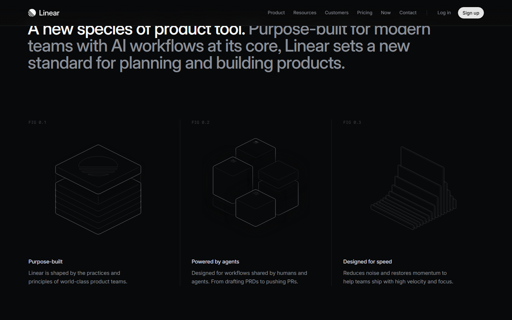

### 33% scroll depth

*Scroll position: 2990px of 9960px total*

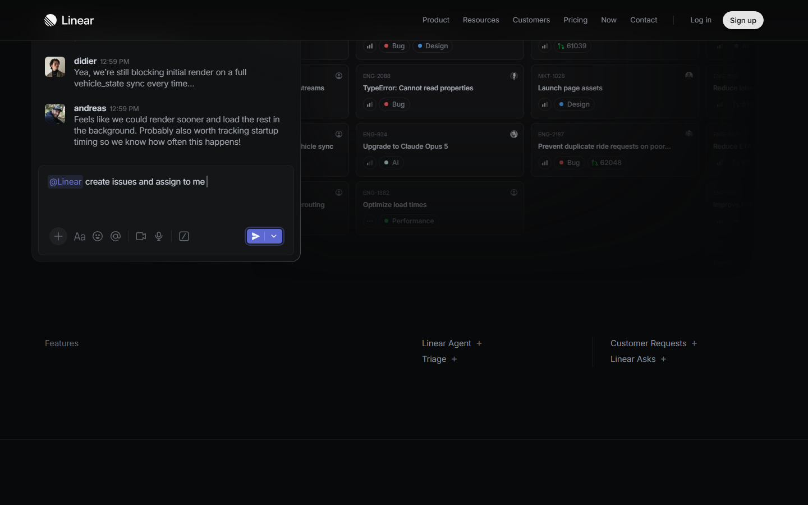

### 50% scroll depth

*Scroll position: 4530px of 9960px total*

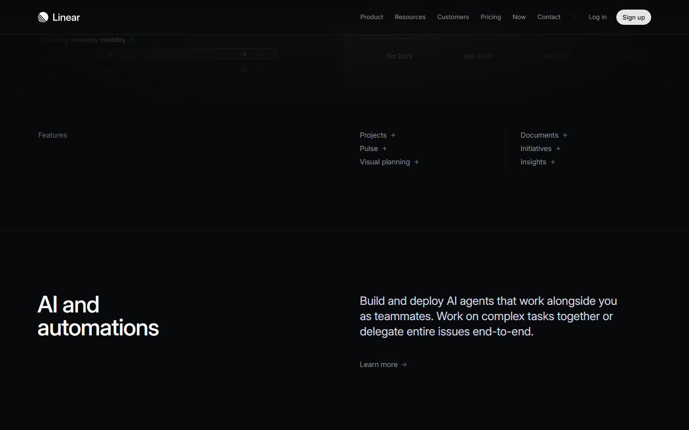

### 67% scroll depth

*Scroll position: 6070px of 9960px total*

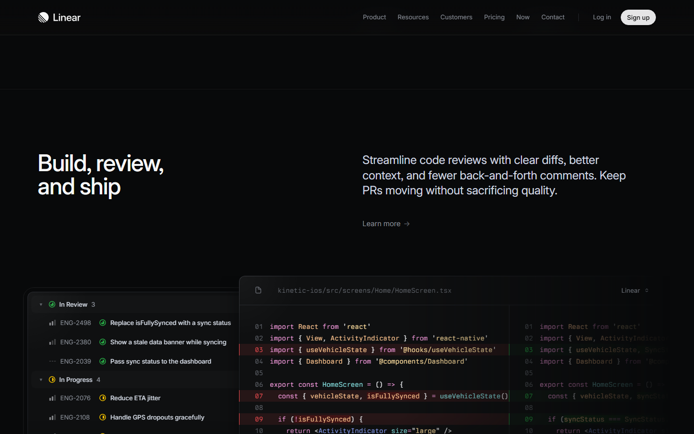

### 83% scroll depth

*Scroll position: 7520px of 9960px total*

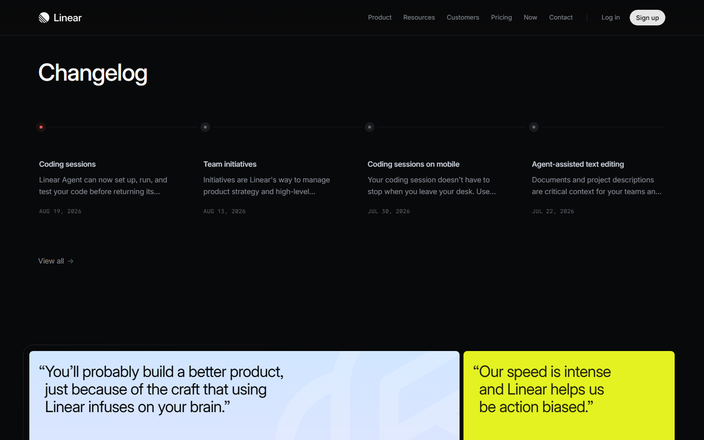

### Footer — End of page

*Scroll position: 9060px of 9960px total*

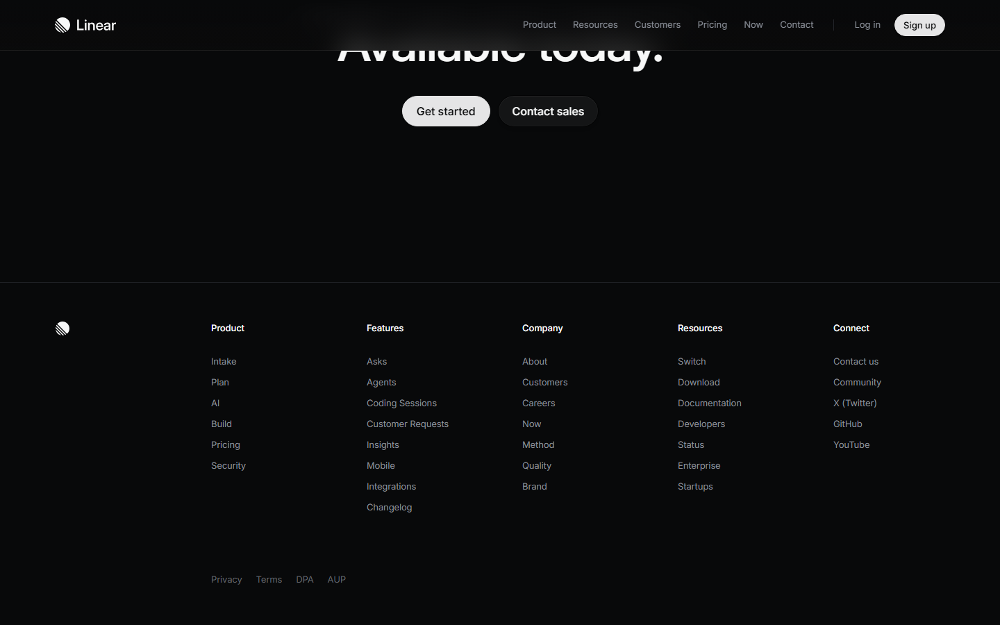

## Full Page Screenshots

### Linear – The system for product development

*URL: `https://linear.app`*

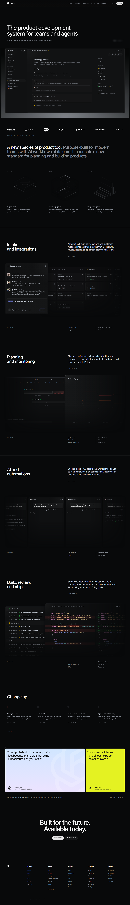

### Linear – The system for product development

*URL: `https://linear.app/homepage`*

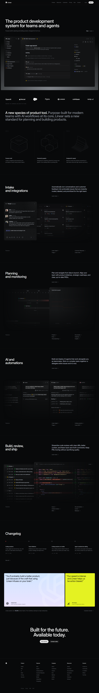

### Linear Customers

*URL: `https://linear.app/customers`*

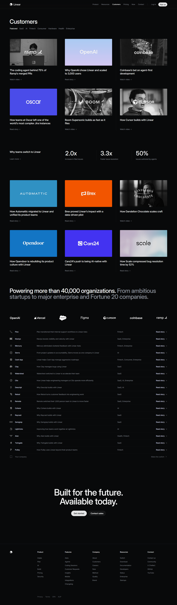

### Pricing – Linear

*URL: `https://linear.app/pricing`*

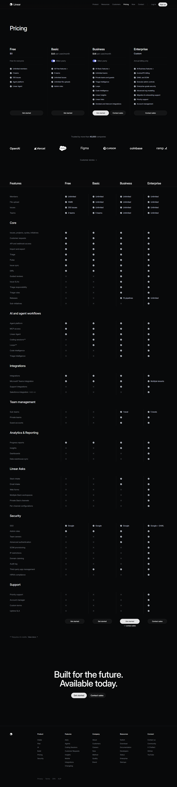

### Now – Updates from the Linear team

*URL: `https://linear.app/now`*

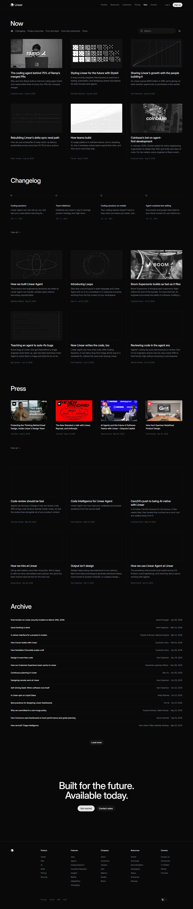

## Section Screenshots

Clipped sections showing individual components in context.

### Section 8 — `main > div`

*1436×1200px*

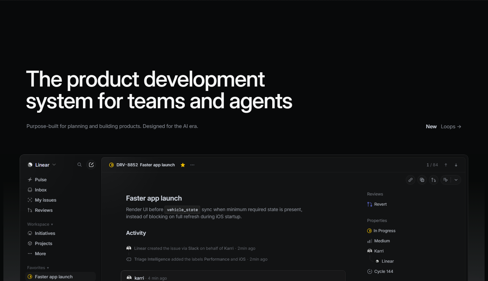

### Section 8 — `main > div`

*1436×1200px*

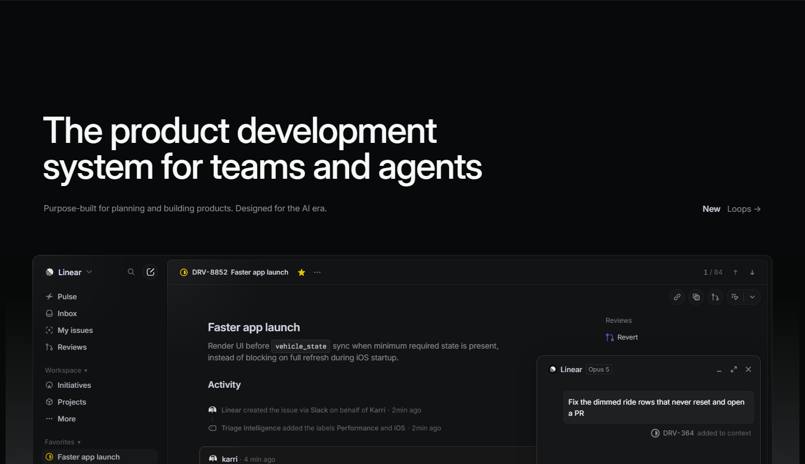

### Section 3 — `main > div`

*1436×1200px*

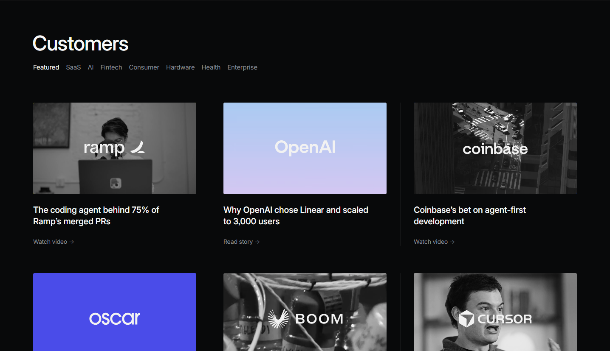

### Section 3 — `main > div`

*1436×1107px*

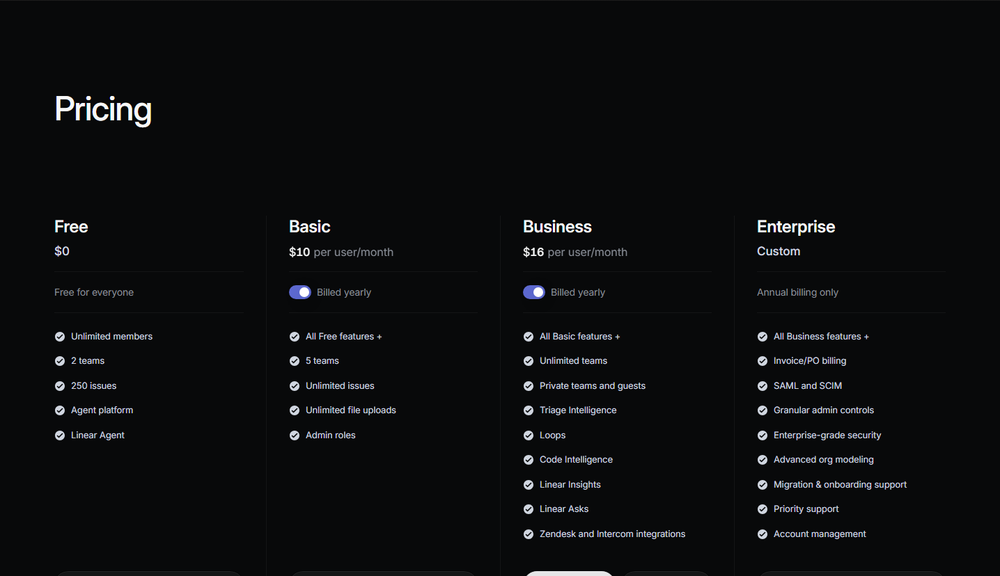

### Section 3 — `main > div`

*1436×1200px*

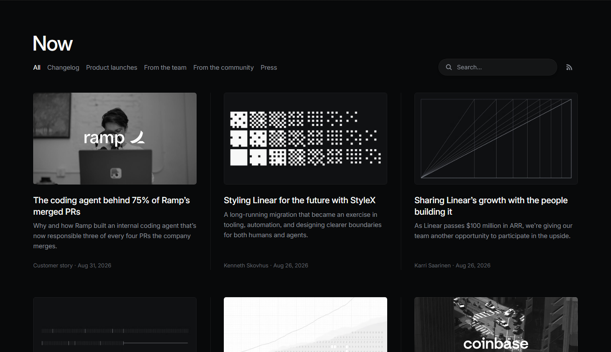

