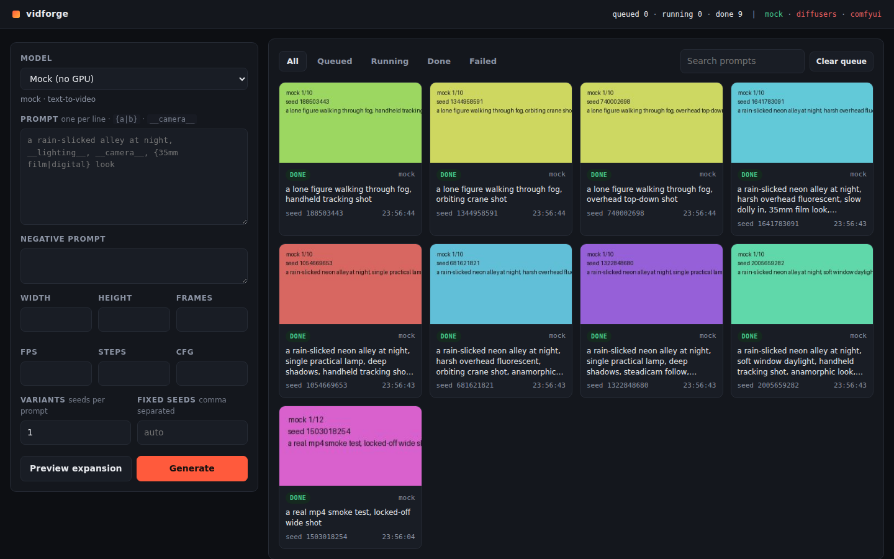

# vidforge

Local video generation with a queue, batch prompt expansion, and a gallery.

Runs open-weights video models on your own hardware. Nothing you type leaves the
machine, and the post-hoc content filters some pipelines ship with are detached
at load time — there is **no NSFW filter** in this app. What the model can
express is a function of the checkpoint and LoRAs you point it at.

Two things it will not do, and these are in the code path, not the docs:
sexual content involving minors, and a real identifiable person's likeness
without a consent record on file. Everything else is yours.



---

## Install

```bash
uv sync              # app + web UI + CLI
uv run vidforge setup
```

`setup` looks at the machine, picks the torch wheel that matches the card it
finds (CUDA / ROCm / MPS / CPU), installs the inference extras, and pre-fetches
a model that fits the VRAM it measured — so the first render is not a 20 GB
wait. `--dry-run` prints the commands without running them.

```
$ uv run vidforge doctor
  platform     Windows AMD64, python 3.11.9
  accelerator  NVIDIA GeForce RTX 4090  (24 GB)
  torch        2.5.1+cu124  [accelerated]
  suggested    wan-14b  - Wan 2.2 14B - the good one
```

`doctor` exits non-zero when something is wrong, and names it — the common one
being a GPU present but a CPU-only torch installed over the top of it.

`uv sync` alone is enough for the **mock** model, which renders without a GPU.
You can also skip torch entirely and drive a running
[ComfyUI](https://github.com/comfyanonymous/ComfyUI) — see *Backends* below.

## Run

```bash
uv run vidforge serve       # http://127.0.0.1:8787
```

Or headless:

```bash
uv run vidforge gen "a rain-slicked alley, __lighting__, __camera__" --model wan-1_3b --variants 4
uv run vidforge batch prompts.jsonl --model wan-1_3b --variants 2
uv run vidforge models | jobs | wildcards | config
```

### From your phone

```bash
uv run vidforge serve --tunnel
```

That prints a public HTTPS link and a QR code. Scan it, and the phone is
looking at the queue on your desktop — no port forwarding, no router config, no
Cloudflare account. It shells out to a Cloudflare quick tunnel, downloading
`cloudflared` into `$VIDFORGE_HOME/bin` if you do not already have it.

Same wifi only, no tunnel:

```bash
uv run vidforge serve --host 0.0.0.0     # prints http://<pc-ip>:8787 and a QR
```

The UI is responsive down to ~360px — one column, two-up parameter fields,
gallery below the composer. Queue a batch from the couch, watch it fill in.

**Access token.** The server is never open. A token is generated on first run
into `$VIDFORGE_HOME/token`; the printed links embed it, and the first request
swaps it for a 30-day cookie and strips it back out of the URL so it stops
living in your history. Open the bare URL and you get a box to paste it into.
`vidforge token` prints it, `--reset` rolls it.

That matters more than it sounds: a quick tunnel URL is unguessable but public.
The token is the only thing between it and the internet.

Everything lives under `$VIDFORGE_HOME` (default `~/.vidforge`): `models.toml`,
`wildcards/`, `outputs/`, `uploads/`, and the SQLite job database.

---

## Wiring in your prompt generator

This is the seam the app is built around. Your generator produces prompts;
vidforge takes it from there — expansion, seed sweeps, queue, gallery.

**A file of prompts** (`.txt` one per line, `.json`, or `.jsonl`; JSON objects
may use a `prompt`, `text`, `positive`, or `description` key):

```bash
uv run vidforge batch prompts.jsonl --model wan-1_3b --variants 3 --steps 30
```

**Over HTTP**, if the generator is another program:

```bash
curl -X POST localhost:8787/api/generate -H 'content-type: application/json' -d '{
  "model_id": "wan-1_3b",
  "prompts": ["prompt one", "prompt two"],
  "variants": 4,
  "params": {"width": 832, "height": 480, "num_frames": 81, "steps": 30}
}'
```

**Template features** applied to every prompt, from either path:

| Syntax | Effect |
|---|---|
| `{a\|b\|c}` | pick one; nests, e.g. `{neon {pink\|blue}\|daylight}` |
| `__camera__` | random line from `$VIDFORGE_HOME/wildcards/camera.txt` |
| `--variants N` | N random seeds per prompt, re-rolling wildcards each time |
| `--seed S` (repeatable) | fixed seeds instead — the same prompt, same output |

`POST /api/prompts/preview` (or **Preview expansion** in the UI) shows exactly
what a template will queue before you commit a 200-clip sweep to the GPU.

Every render writes a JSON sidecar next to the video with the resolved prompt,
seed, model, LoRAs and every parameter — so anything in the gallery can be
reproduced or re-rolled later.

---

## Models

`$VIDFORGE_HOME/models.toml` is the registry; adding a model never means
touching code. It ships with entries for Wan 2.1/2.2 (t2v and i2v), LTX-Video,
HunyuanVideo and SVD.

```toml
[model.house-style]
backend = "diffusers"
kind = "t2v"
repo = "Wan-AI/Wan2.1-T2V-1.3B-Diffusers"   # HF id, local dir, or .safetensors
pipeline_class = "WanPipeline"
loras = [{ repo = "/models/loras/my-style.safetensors", weight = 0.9, name = "style" }]
defaults = { width = 832, height = 480, num_frames = 81, fps = 16, steps = 30 }
```

Start with `wan-1_3b` (~8GB VRAM). `offload = true` trades speed for fitting on
a smaller card. `pipeline_class` accepts anything diffusers exports, so a new
model usually needs a registry entry and nothing else.

## Backends

| Backend | Use it when |
|---|---|
| `mock` | no GPU — exercises the queue, UI and tests end to end |
| `diffusers` | local torch inference; strips `safety_checker` and `watermarker` on load |
| `comfyui` | you already have a working ComfyUI node stack |

For ComfyUI: export a graph with **Save (API Format)**, drop it in
`$VIDFORGE_HOME/workflows/`, and put `%prompt%`, `%negative_prompt%`, `%seed%`,
`%width%`, `%height%`, `%num_frames%`, `%steps%`, `%cfg%` in the fields you want
vidforge to drive. It queues, batches, and files the results; ComfyUI does the
rendering.

Output is MP4 (h264). `imageio-ffmpeg` ships its own encoder, so this works with
no system ffmpeg; on a stripped ffmpeg the encoder falls back through VP9/VP8 and
finally animated WebP rather than failing.

---

## Guardrails

`vidforge/guardrails.py`, ~200 lines, and you can read all of it.

**Minors.** A prompt is refused when sexual context co-occurs with a term
denoting a minor, or with a stated age under 18. Ambiguous industry words
(`teen`, `barely legal`) are cleared by an explicit adult age in the prompt, so
`nude 19 year old` passes and `nude teen` does not. Only the *positive* prompt
is scanned — `child` in a negative prompt is good practice and is never
penalised. A template is screened before it expands, and each expansion is
screened again, so a wildcard file cannot smuggle a term past the check.

**Likeness.** An identity/face reference image, or language aimed at a specific
real person (`deepfake`, `face swap`, `likeness of`, `my ex`), requires a
consent record:

```bash
uv run vidforge consent add --subject "Jane Doe" --attested-by "Jane Doe" --note "signed release"
uv run vidforge gen "..." --init-image jane.png --identity-reference --consent-id <id>
```

The register is a plain JSON file you maintain. It does not prove anything on
its own — it makes the attestation explicit, dated and auditable instead of
implicit. Prompt-only naming of a public figure is not reliably detectable and
the app does not pretend otherwise; the enforceable control is on identity
references.

Dry-run any prompt without queueing:

```bash
uv run vidforge check "a 25 year old woman, nude, cinematic lighting"   # allowed
```

---

## API

| Method | Path | |
|---|---|---|
| `GET` | `/api/models` | registry |
| `GET` | `/api/status` | worker state, queue counts, per-backend readiness |
| `POST` | `/api/generate` | screen, expand, queue |
| `POST` | `/api/prompts/preview` | expand without queueing |
| `GET` | `/api/jobs` | filter by `status`, `batch_id`, `search` |
| `POST` | `/api/jobs/{id}/cancel` | cancel queued or interrupt running |
| `DELETE` | `/api/jobs/{id}` | remove row and files |
| `POST` | `/api/queue/clear` | cancel everything queued |
| `GET` | `/media/{id}` · `/media/{id}/thumb` | the clip and its poster frame |
| `POST` | `/api/uploads` | init image for image-to-video |
| `GET` `POST` `DELETE` | `/api/consent[/{id}]` | likeness consent register |
| `GET` | `/healthz` | liveness, the one route that needs no token |

Every other route requires the token as `?token=`, an `X-Vidforge-Token`
header, `Authorization: Bearer`, or the cookie. CORS is open so a page on
another origin can drive the server, but credentials are off — a cross-origin
caller has to present the header, and no other site can make a browser attach
your cookie.

Media is only ever served from inside `$VIDFORGE_HOME`, whatever the database
row says.

## Tests

```bash
uv run pytest
```

96 tests covering guardrails, prompt expansion, the SQLite queue, worker
lifecycle (a failing backend must not kill the worker), token auth and CORS,
machine detection and wheel selection, tunnel startup failure modes, the
diffusers backend's filter-stripping and kwarg handling against a stub
pipeline, and the full HTTP round trip through the mock backend.

No GPU required, and no weights are downloaded.

## Layout

```
vidforge/
├── api.py              FastAPI app + web UI mount
├── cli.py              serve / gen / batch / models / jobs / check / consent
├── service.py          screen -> expand -> queue
├── worker.py           single-threaded render loop, durable queue
├── guardrails.py       the two hard checks
├── prompts.py          wildcards, alternation, seed sweeps, file loading
├── db.py               SQLite job store
├── media.py            frame encoding, thumbnails
├── config.py           settings + models.toml registry
├── auth.py             token generation and presentation
├── tunnel.py           cloudflared quick tunnel + QR
├── bootstrap.py        machine detection, wheel selection, prefetch
├── backends/           mock · diffusers · comfyui
└── static/             the web UI (no build step)
```
